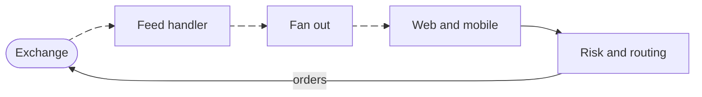

# Nakul Thakur

**Founder, [Sapphire Broking](https://sapphirebroking.com)**

I run a stock brokerage and build the software behind it. The first job is mostly decisions, the second is mostly systems.

Nagpur, India (UTC+5:30)&nbsp;·&nbsp;Writing software since 2019

### Sapphire Broking

An online stock brokerage in India.

The shape of the problem is easy to draw and unforgiving in practice. Market data comes in, orders go out, and the client apps sit in between.

The moving edges are the market data path, which streams continuously. Orders are discrete events, so those edges hold still. Matching happens at the exchange, not here.

Trading software fails in ways that are expensive and public. That raises the bar on correctness and latency considerably.

### Running the company

Most of my week now goes to work that is not writing code.

**Regulation**&nbsp;&nbsp;A brokerage operates inside rules it does not get to set. Treating them as a design input rather than a final checklist is cheaper, and I learned that the expensive way. 
**Priorities**&nbsp;&nbsp;Most of the job is deciding what not to build yet. Nearly everything on the list is reasonable, which is what makes the cut hard. 
**Hiring**&nbsp;&nbsp;A team in the teens has nowhere to hide a weak hire, and no spare capacity to carry one. Waiting for the right person costs less than correcting for the wrong one. 
**Downtime**&nbsp;&nbsp;An outage is not an inconvenience here. It is someone unable to act on a position they are holding.

### Working with people

Handing over something I used to own is still the part I am worst at. Keeping the context in my own head feels faster, and it turns me into the bottleneck.

So I write things down. The decision, the reasoning under it, and what would have to change for us to reverse it. It is slower in the moment, and it has saved us from having the same argument twice.

When a call I made turns out to be wrong, saying so early is the cheapest option available. Everyone can see it already. The only open question is how long we spend working around it.

### How I work

I start with the data model and the boundaries between the parts, because those are the decisions that get expensive to change later.

I like small modules with narrow interfaces and explicit dependencies. The test I apply is whether I can delete one and predict exactly what breaks. When I cannot, the seams are usually in the wrong place.

The same instinct pulls me toward what a system does under load, and what it does when a dependency stops answering. It transfers awkwardly to a company, where the parts are people and none of the interfaces are written down. I am still working out how much of it applies.

<strong>Stack</strong>

**Languages**&nbsp;&nbsp;Go · TypeScript · JavaScript · Python · Dart · Kotlin 
**Web**&nbsp;&nbsp;React · Next.js · Tailwind 
**Mobile**&nbsp;&nbsp;Flutter 
**Services**&nbsp;&nbsp;Go · Node.js · Express · REST · WebSockets 
**Data**&nbsp;&nbsp;PostgreSQL · Redis 
**Platform**&nbsp;&nbsp;Docker · Linux · Git · CI/CD · Cloud

Tools I reach for most often.

### Contact

Always glad to talk about architecture, systems design, and what running a small regulated business actually takes.

[Email](mailto:workfornakul@gmail.com)&nbsp;·&nbsp;[LinkedIn](https://www.linkedin.com/in/Nakkuuul)&nbsp;·&nbsp;[X](https://x.com/Nakkuuul)
